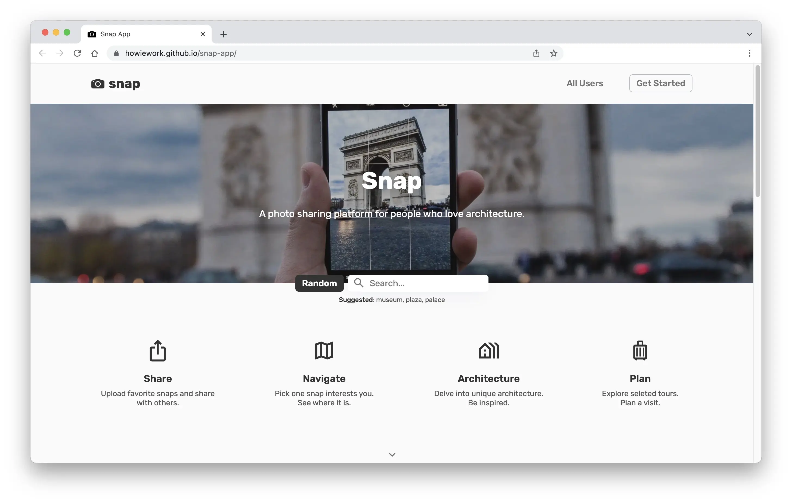

<!-- ----------------------------------------- -->

<!-- BADGES/SHIELDS SECTION -->
<!-- NOTE REFERENCE STYLE FOR READABILITY -->

![Last Commit][last-commit-shield]
[![MIT License][license-shield]][license-url]
[![Twitter][twitter-shield]][twitter-url]

 

<!-- ----------------------------------------- -->

<!-- HEAD SECTION -->

  <!-- PROJECT LOGO / TITLE -->
  

  <h3>Share · Navigate · Architecture · Plan</h3>

  

   A photo sharing platform for people who love architecture!
  

   

  <!-- PROJECT LINKS -->
  

    <a href="https://howiework.github.io/snap-app/" target="_blank"><strong>Demo</strong></a>
    ·
    <a href="https://github.com/othneildrew/Best-README-Template" target="_blank"><strong>GitHub</strong></a>
    ·
    <a href="#contact"><strong>Contact</strong></a>
    <!-- 
    ·
    <a href="#"><strong>REPORT/REQUEST</strong></a> 
    -->
  

   

<!-- ----------------------------------------- -->

<!-- TABLE OF CONTENTS SECTION -->

  
Table of Contents

  <ol>
    <li>
      <a href="#overview">Overview</a>
      <ul>
        <li><a href="#built-with">Built with</a></li>
      </ul>
    </li>
    <li><a href="#features">Features</a></li>
    <li><a href="#roadmap">Roadmap</a></li>
    <li><a href="#contributors">Contributors</a></li>
    <li><a href="#license-&-copyright">License & Copyright</a></li>
    <li><a href="#contact">Contact</a></li>
  </ol>

<!-- ----------------------------------------- -->

<!-- OVERVIEW SECTION -->

## Overview

 

Remember saw some inspiring architecture photos, but have no idea where it is? Want to share your photos with like-mined people? Trying to learn more about specific architecture?

Snap App focus on creating a photo sharing platform for people who love architecture. It integrates sharing, navigation, architecture information and tour planning together. Its goal is to create a community and let its audience get inspired and live a better life.

 

### Built with

<!-- - [React.js](https://reactjs.org/)

- [Node.js](https://nodejs.org/)

- [Express](https://expressjs.com/)

- [MongoDB](https://www.mongodb.com/) -->

[![React][react-shield]][react-url]
[![Node][node-shield]][node-url]
[![Express][express-shield]][express-url]
[![Axios][axios-shield]][axios-url]
[![Mongoose][mongoose-shield]][mongoose-url]

<a href="#top">Back to Top ↑</a>

<!-- ----------------------------------------- -->

## Features

<a href="#top">Back to Top ↑</a>

<!-- ----------------------------------------- -->

## Roadmap

- [x] Frontend
  - [x] Basic structure: Pages & Routes
  - [ ] Spanish
- [x] Add back to top links
- [ ] Add Additional Templates w/ Examples
- [ ] Add "components" document to easily copy & paste sections of the readme
- [ ] Multi-language Support
  - [ ] Chinese
  - [ ] Spanish

<a href="#top">Back to Top ↑</a>

<!-- ----------------------------------------- -->

## Contributors

- Howie Wang <howiewang2020@gmail.com>

<!-- ----------------------------------------- -->

## License & copyright

© Howie Wang

Licensed under the [MIT License](LICENSE)

<!-- ----------------------------------------- -->

## Contact

- Howie Wang <howiewang2020@gmail.com>

<a href="#top">Back to Top ↑</a>

<!-- ----------------------------------------- -->

<!-- BADGES/SHIELDS REFERENCE -->
<!-- Site Related -->

[site-screenshot]: assets/site-screenshot.webp
[demo-url]: https://howiework.github.io/snap-app/

<!-- Built with -->

[react-shield]: https://img.shields.io/static/v1?label=React&message=v17.0.2&color=blue&style=flat-square
[react-url]: https://reactjs.org/
[node-shield]: https://img.shields.io/static/v1?label=Node&message=v14.17.4&color=green&style=flat-square
[node-url]: https://nodejs.org/
[express-shield]: https://img.shields.io/static/v1?label=Express&message=v4.17.1&color=lightgrey&style=flat-square
[express-url]: https://expressjs.com/
[axios-shield]: https://img.shields.io/static/v1?label=Axios&message=v0.24.0&color=purple&style=flat-square
[axios-url]: https://axios-http.com/
[mongoose-shield]: https://img.shields.io/static/v1?label=Mongoose&message=v6.0.14&color=brightgreen&style=flat-square
[mongoose-url]: https://mongoosejs.com/

<!-- General -->

[last-commit-shield]: https://img.shields.io/github/last-commit/howiework/snap-app?style=flat-square
[license-shield]: https://img.shields.io/github/license/howiework/snap-app?style=flat-square
[license-url]: https://github.com/HowieWork/snap-app/blob/gh-pages/LICENSE
[twitter-shield]: https://img.shields.io/twitter/follow/howiework?label=Follow%20%40howiework&logo=Twitter&style=flat-square
[twitter-url]: https://twitter.com/howiework
